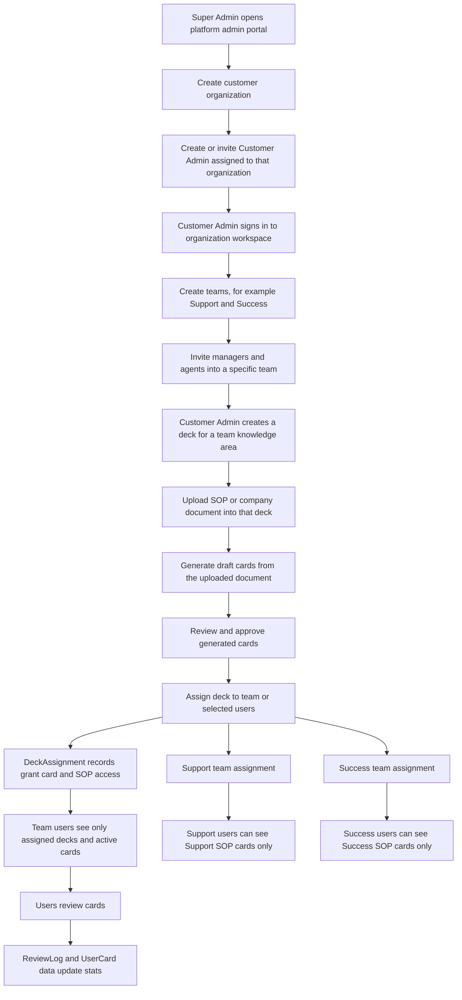

# Customer Organization, Team, and SOP Access Flow

This document describes the intended customer setup and SOP visibility model for RecallAI.

## Target Flow

## Current Implementation

- Super admins can create organizations in `/admin` through `POST /api/admin/organizations`.
- Super admins can create users and assign them to an organization through `POST /api/admin/users`.
- Customer admins can create teams through `POST /api/teams`.
- Customer admins and managers can invite managers or agents into a specific team through `POST /api/teams/[teamId]/invite`.
- SOP uploads are attached to an organization and optionally to a deck through `POST /api/documents/upload`.
- Card generation turns a source document into draft cards. Cards must be approved before agents see them.
- Deck assignment is the current team targeting mechanism. `POST /api/decks/[deckId]/assign` can assign a deck to a team or selected users.
- Agents are now gated by deck assignment for deck listing, deck card reads, due-card selection, and review stats.

## Access Rules

| Actor | Allowed setup actions | SOP/card visibility |
| --- | --- | --- |
| Super Admin | Create organizations and platform users | Platform admin only; redirected away from workspace routes |
| Customer Admin | Manage org settings, teams, users, decks, uploads, generation, assignment | All organization decks and documents |
| Manager | Manage team-level training areas under the current product model | Currently all organization decks and documents |
| Agent | Review assigned training cards | Only assigned decks and active cards |

## Logic Still To Decide

- Direct document-to-team ownership is not modeled yet. Today, a document is scoped by organization and targeted through the deck it belongs to. If managers or agents ever need a browsable SOP library, add `teamId` on `SourceDocument` or a `SourceDocumentAssignment` table.
- Manager isolation is still a product decision. Current code treats managers as org-wide training managers. If support managers must not see success SOPs, manager routes should use team membership and deck assignments just like agents.
- Customer-admin onboarding is user creation plus welcome/reset email, not the same team invite flow used for managers and agents. If the product language must be "invite customer admin," add a platform-level invite model for admins.
- Team assignment only grants access to users who are team members at assignment time. If a user joins a team later, the app should either auto-assign that team's decks on invite acceptance or compute team deck access dynamically.
- Upload and generation are asynchronous. The e2e flow should always assert the document reaches `READY`, generation job completes, draft cards exist, cards are approved, and then team-assigned users can review them.

## Live E2E Notes From 2026-05-02

- The in-app browser backend did not navigate successfully in this Codex session, so live checks used HTTP/session-cookie probes.
- Existing authenticated agent session: `GET /api/review/stats` returned 200.
- Existing authenticated agent session: `GET /api/decks` returned 500, which blocks the production SOP upload/card-click path before card generation can be tested end to end.
- Direct credential callback on production redirected to `error=Configuration`, indicating a production auth/deployment configuration issue still needs investigation outside the code path tested here.
